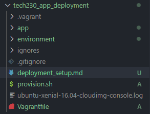
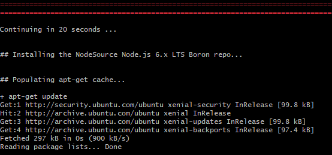
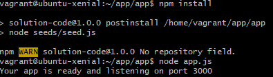
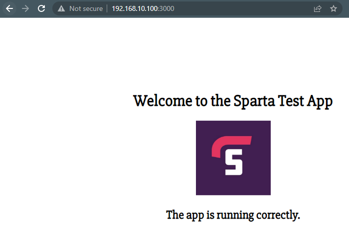

# **Deploying an application within a Virtual Machine**

### **Setting up a new repository with Vagrant**

For this example, create a directory called `app_development`:

    mkdir app_development

_Note: reminder to place the `Application` and `Environment` file into this directory._

Within the gitbash terminal, whilst being in the repo., initialise Vagrant:

    vagrant init

Create a new provisioning shell script called `provision.sh` to automate the initial gitbash setup commands:

```gitbash
#!/bin/bash

sudo apt-get update -y

sudo apt-get upgrade -y

sudo apt-get install nginx -y

sudo systemctl start nginx
```

Amend and add the following to the configuration of the operating system, provisioning and synced files commands:

```ruby
Vagrant.configure("2") do |config|

  # configures the VM settings
  config.vm.box = "ubuntu/xenial64"
  config.vm.network "private_network", ip:"192.168.10.100"

  # provision the VM to have nginx
  config.vm.provision "shell", path: "provision.sh"

  # put the app folder from our local machine to the vm
  config.vm.synced_folder "app", "/home/vagrant/app"

end
```

Check the repo. contains all of the relevant files:



### **Deploy the Virtual Machine and install the relevant JavaScript packages**

Deploy the Virtual Machine through vagrant with:

    vagrant up

Connect to the Virtual Machine through:

    vagrant ssh

Once in the Virtual Machine, install the specific `NodeJS` version through the python package manager `python-software-properties` as shown:

    sudo apt-get install python-software-properties -y

Retrieve the appropriate package (`curl -sL`) for the debian distribution within a bash shell (`-E bash`):

    curl -sL https://deb.nodesource.com/setup_6.x | sudo -E bash -

Confirm the package has been found and is being installed.



The appropriate `NodeJS` version (6.x) can now be installed with:

    sudo apt-get install nodejs -y

Follow up with installing `NodeJS`' production process manager `pm2`:

    sudo npm install pm2 -g

Navigate to the `/app` folder in the Virtual Machine and install `npm`:

    npm install

Run the main application file:

    node app.js

The following message should be shown within the terminal; this final line informs the user the application has been deployed to port 3000:



Access the application through entering the local IP address and port number in a browser:

    192.168.10.100:3000

The application can now be shown running:



### **Additional: Automating the vagrant configuration to run the application directly**

Amend the `provision.sh` file to include the commands to install application dependant JavaScript packages and run the application.

The `provision.sh` file should now display the following:

```
#!/bin/bash

sudo apt-get update -y

sudo apt-get upgrade -y

sudo apt-get install nginx -y

sudo systemctl start nginx -y

# install application dependant JavaScript packages

sudo apt-get install python-software-properties -y

curl -sL https://deb.nodesource.com/setup_6.x | sudo -E bash -

sudo apt-get install nodejs -y

sudo npm install pm2 -g

# install npm within the app directory run the application

cd app

cd app

npm install

node app.js
```
Ensure the vagrant run Virtual Machine is off using `vagrant halt --force`, then rerun the Virtual Machine.

```
vagrant up
```
The final line on the terminal, after executing the vagrant script, should be "`Your app is ready and listening on port 3000`".

Navigate to a web browsers address bar and enter "`192.168.10.100:3000`" to display the application.