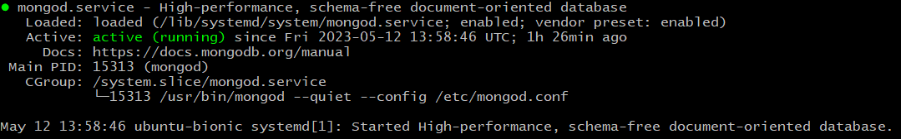
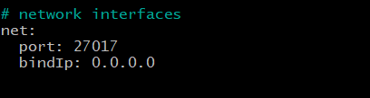
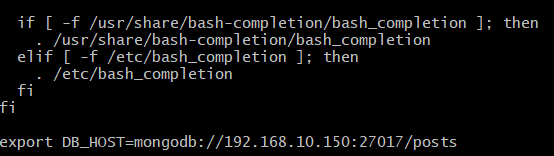
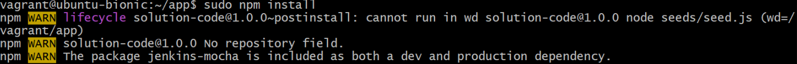
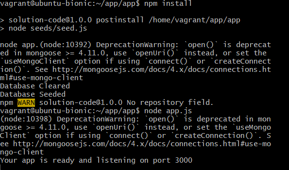
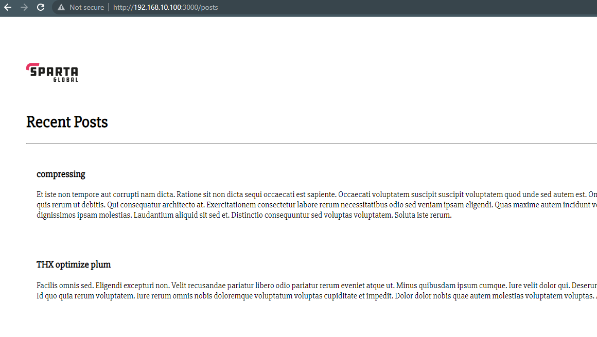
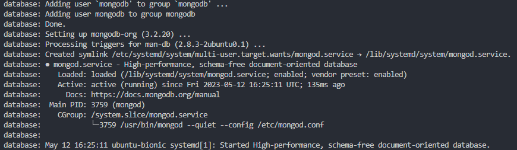

## **Deploying two Virtual Machines in a single Vagrant file**

### **Setting up the Vagrant files**

1. Follow the guidance to setup one [Virtual Machine](https://github.com/PutuJem/tech230_app_deployment) and retrieve the associated files.
2. Amend the vagrant file to include the database configuration; initially, change the OS configuration to `ubuntu/bionic64` and nest the application configuration commands as follows:
```ruby

  config.vm.define "app" do |app|

    # configures the VM settings
    app.vm.box = "ubuntu/bionic64"
    app.vm.network "private_network", ip:"192.168.10.100"

    # put the app folder from our local machine to the vm
    app.vm.synced_folder "app", "/home/vagrant/app"

    # provision the VM to have nginx
    app.vm.provision "shell", path: "provision.sh", privileged:false
  
  end
```

3. Add the following database configuration:
```ruby
  config.vm.define "database" do |db|

    # configures the VM settings
    db.vm.box = "ubuntu/bionic64"
    db.vm.network "private_network", ip:"192.168.10.150" # any number between 1-255

    db.vm.synced_folder "environment", "/home/vagrant/environment"
      
  end
```
4. The complete script should display:
```ruby
Vagrant.configure("2") do |config|


  config.vm.define "app" do |app|

    # configures the VM settings
    app.vm.box = "ubuntu/bionic64"
    app.vm.network "private_network", ip:"192.168.10.100"

    # put the app folder from our local machine to the vm
    app.vm.synced_folder "app", "/home/vagrant/app"

    # provision the VM to have nginx
    app.vm.provision "shell", path: "provision.sh", privileged:false
  
  end

  config.vm.define "database" do |db|

    # configures the VM settings
    db.vm.box = "ubuntu/bionic64"
    db.vm.network "private_network", ip:"192.168.10.150" # any number between 1-255

    db.vm.synced_folder "environment", "/home/vagrant/environment"
      
  end
end
```
_Note: reminder to close the `do` block with an `end` command at the end of the code block on the same indentation._

5. Adjust the `provision.sh` file to NOT include the commands to proceed to the app directory and run the application.

This includes the commands:
```linux
cd app

npm install

node app.js
```
_Note: these commands will be performed manually to ensure there are no issues with the setup prior to deployment._

### **Accessing and configuring the environment Virtual Machine**

6. Open two separate terminals to connect to the application and environment.
7. Connect to the Virtual Machines in the separate terminals through ssh as follows:
```
vagrant ssh app
```
```
vagrant ssh database
```
8. Within the `database` terminal, update and upgrade the packages:
```
sudo apt-get update -y
```
```
sudo apt-get upgrade -y
```
9. To access mongoDB, a key is required from the key server:
```
sudo apt-key adv --keyserver hkp://keyserver.ubuntu.com:80 --recv D68FA50FEA312927
```
10. The retrieved key is then required to be read and stored to mongoDB' root repo:
```
echo "deb https://repo.mongodb.org/apt/ubuntu xenial/mongodb-org/3.2 multiverse" | sudo tee /etc/apt/sources.list.d/mongodb-org-3.2.list
```
11.  Once access to mongoDB has been acquiured, repeat `step 8` to ensure the latest packages are installed for mongoDB.
12.  To run the environment, install mongoDB version 3.2:
```
sudo apt-get install -y mongodb-org=3.2.20 mongodb-org-server=3.2.20 mongodb-org-shell=3.2.20 mongodb-org-mongos=3.2.20 mongodb-org-tools=3.2.20
```
13.  The database can now be run with `start` followed by `enable`. The `enable` keeps the database in a running state and creates multiple versions of itself for others to access.
```
sudo systemctl start mongod
```
```
sudo systemctl enable mongod
```
14. Check the status of the database to ensure it is `active (running)`.
```
sudo systemctl status mongod
```


15. To allow access to the application, the network interfaces configuration needs to be amended. Firstly, open the configuration file:
```
sudo nano /etc/mongod.conf
```
16. Navigate to the `network interfaces` section and amend the `bindIP` as shown below:
```
sudo nano /etc/mongod.conf
```


17. restart and re-enable the database to realise these changes:
```
sudo systemctl restart mongod
```
```
sudo systemctl enable mongod
```
### **Configuring and running the application Virtual Machine**
18.  The database can now be connected to the application as an environment variable. To ensure the connection is initiated everytime the Virtual Machine is started, it should be embedded into the bash shell script `.bashrc`. Firstly, open the `.bashrc` file:
```
sudo nano .bashrc
```
19. Add the following `export` command to the end of the script as shown:
```
export DB_HOST=mongodb://192.168.10.150:27017/posts (right at the bottom)
```


20. Read and execute the `.bashrc` file.
```
Source .bashrc
```
21. Navigate to the app folder (there may be two app directories to cd into).
```
cd app
```
22. Install the package manager `npm`; if admin rights are required, try `sudo apt install npm`:
```
npm install
```
_Note: if the data base has not been seeded, as shown in the screenshot below, run `node seeds/seed/js`._



23. Run the application and ensure the following are shown in the terminal.
```
node app.js
```



24. Finally, navigate to the web browser and enter the web server through `192.168.10.100:3000/posts`. The following web page should be shown:



### **Automating the mongoDB Virtual Machine setup**

25.  Create a new provision file for the database called `provision_db.sh` with the commands detailed within the **`Accessing and configuring the environment Virtual Machine`** section.
```
sudo apt-get update -y

sudo apt-get upgrade -y

sudo apt-key adv --keyserver hkp://keyserver.ubuntu.com:80 --recv D68FA50FEA312927

echo "deb https://repo.mongodb.org/apt/ubuntu xenial/mongodb-org/3.2 multiverse" | sudo tee /etc/apt/sources.list.d/mongodb-org-3.2.list

sudo apt-get update -y

sudo apt-get upgrade -y

sudo apt-get install -y mongodb-org=3.2.20 mongodb-org-server=3.2.20 mongodb-org-shell=3.2.20 mongodb-org-mongos=3.2.20 mongodb-org-tools=3.2.20

sudo systemctl start mongod

sudo systemctl enable mongod

sudo systemctl status mongod
```
26.  Add the new provision command within the database configuration in the vagrant file.
```ruby
config.vm.define "database" do |db|

  # configures the VM settings
  db.vm.box = "ubuntu/bionic64"
  db.vm.network "private_network", ip:"192.168.10.150" # any number between 1-255

  db.vm.synced_folder "environment", "/home/vagrant/environment"

  # provision the VM to setup mongodb
  db.vm.provision "shell", path: "provision_db.sh", privileged:false
    
end
```
27.  Run the Virtual Machine with `vagrant up` and ensure the following is shown in the terminal for a successful setup.



### **Troubleshooting**

28. If the port is in use when attempting to launch the application, run `ps aux` to find all the processes currently running.
29. Locate the process running as a `node.js` file and its PID value.
30. Run `sudo kill -9 <PID>` to kill the process.